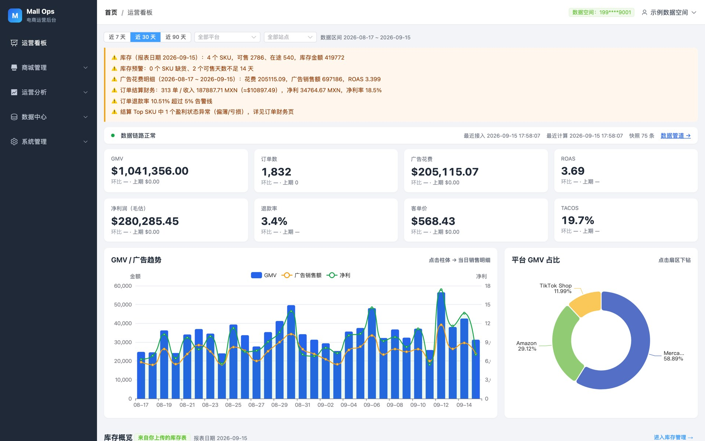
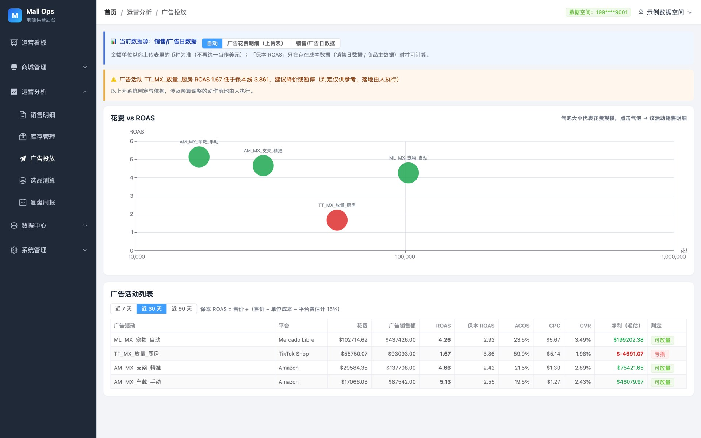
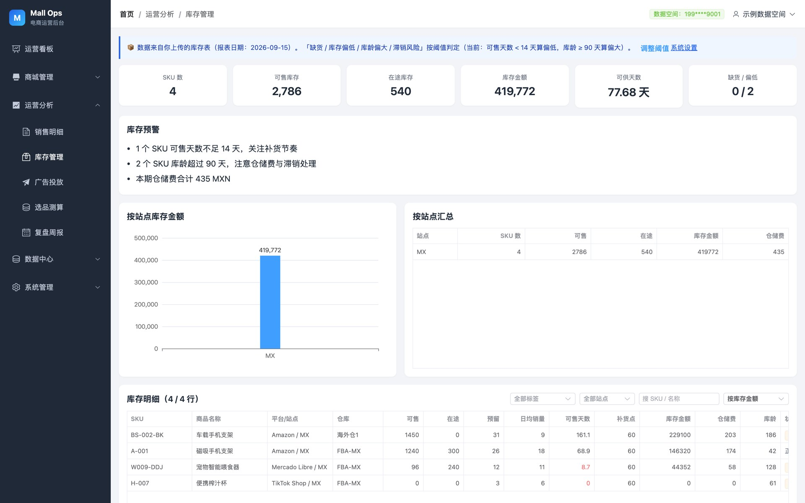
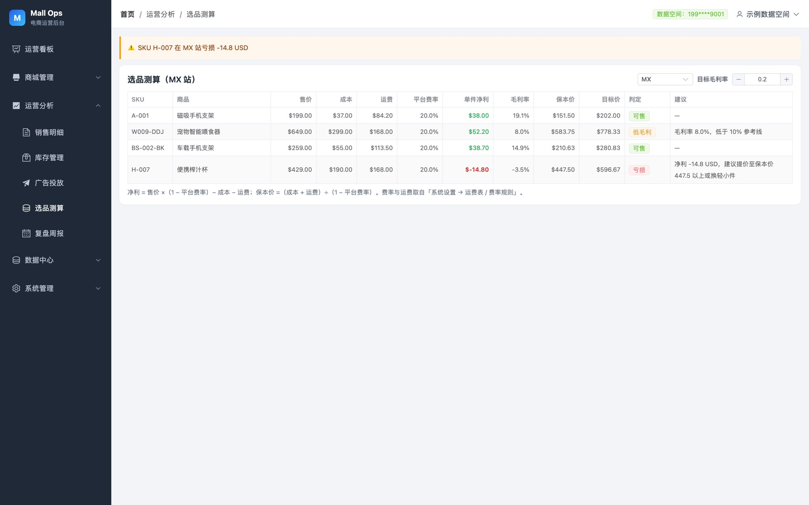
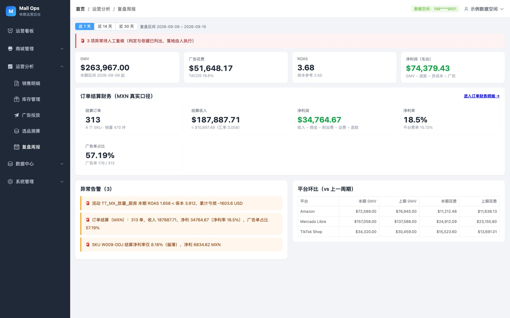
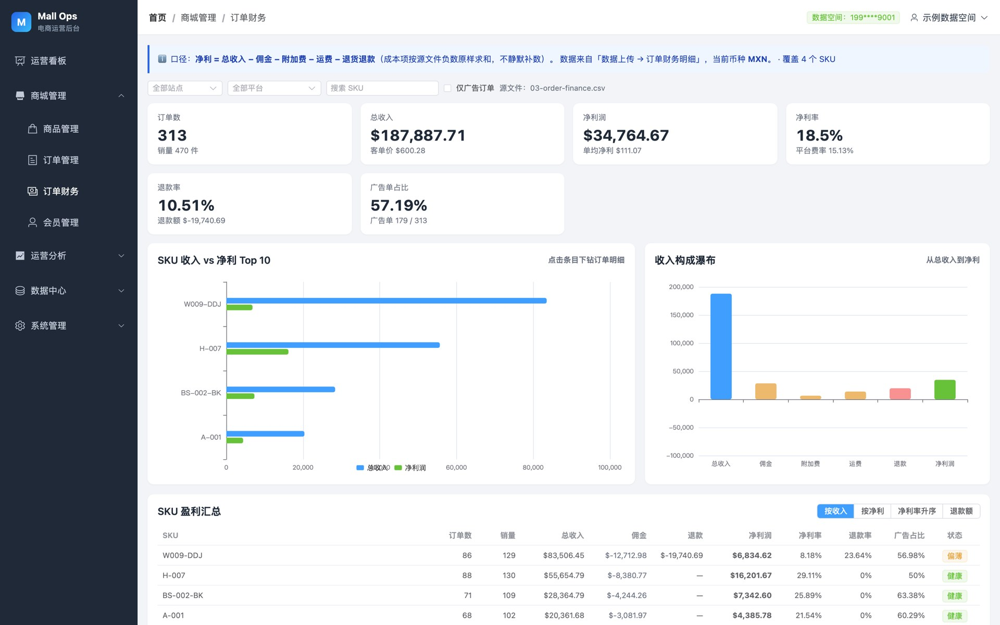
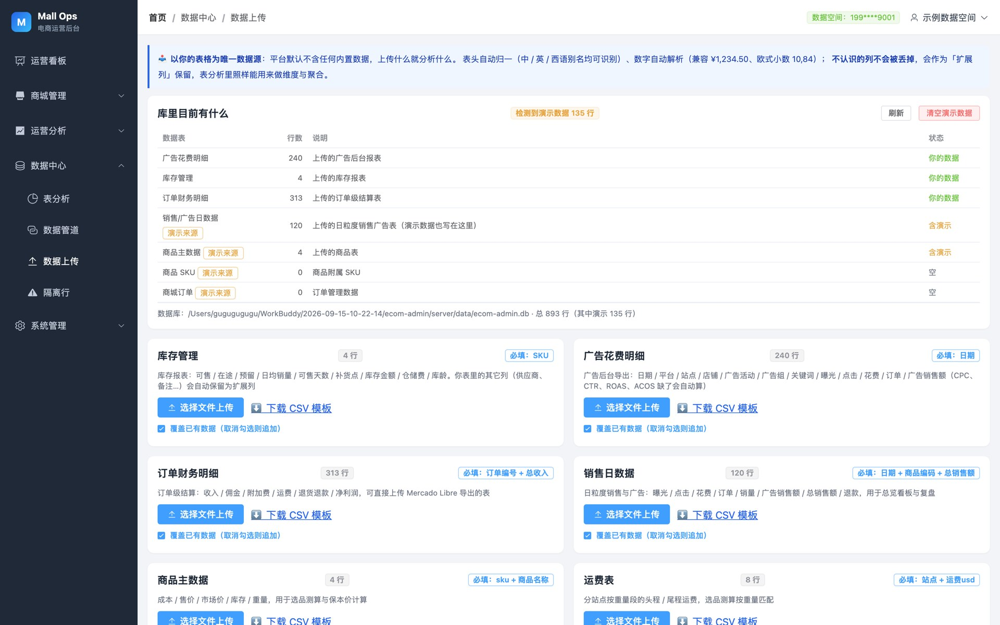

# Mall Ops · 电商运营数据中台

[](./LICENSE)
[](https://nodejs.org)
[](https://vuejs.org)
[](https://element-plus.org)

开箱即用的跨境电商运营后台：**注册即用、上传数据即出分析**。多账号数据物理隔离、北京时间全链路统一、ETL 指标管道自动重算，覆盖看板、销售、库存、广告、选品、订单结算与复盘周报；并以 SKU 为主线提供**增长中枢**：选品研究 → 商品链接 → 达人建联 → 素材库 → 视频发布，销售 / 广告 / 库存数据自动回流到每个 SKU（详见 [docs/automation-roadmap.md](docs/automation-roadmap.md)）。

## ✨ 在线体验

**👉 <https://ecom-data-platform.app.workbuddy.host/>**

打开登录页后点「**先逛逛演示账号（含示例数据，无需注册）**」，即可直接进入带完整示例数据的系统；也可以用手机号 + 验证码注册一个**只属于你的空白数据空间**（演示环境验证码直接显示在页面上）。

## 📷 产品展示

**运营看板** —— KPI 环比、GMV/广告/净利趋势、平台占比、全站告警，图表点击下钻



**广告投放** —— 花费 vs ROAS 气泡图，保本 ROAS 自动判定（可放量 / 观察 / 亏损）



**库存管理** —— 缺货 / 库存偏低 / 滞销积压 / 库龄偏大自动预警，阈值可随时调整并自动重算



**选品测算** —— 按站点测算净利 / 保本价 / 目标价，亏损标红并给出提价建议



**复盘周报** —— 环比告警、平台对比、亏损活动清单（判定与依据给到人，落地由人执行）



**订单结算财务** —— 收入构成瀑布、SKU 盈利汇总、退款率/佣金率口径透明



**数据上传** —— CSV/Excel 上传即清洗入库：表头别名归一、脏数字解析、隔离行可追溯



## 🚀 快速开始

```bash
git clone https://github.com/xianglouw/ecom-data-platform.git ecom-data-platform
cd ecom-data-platform
./start.sh          # 自动安装依赖 → 构建前端 → 启动服务
```

启动后访问 <http://127.0.0.1:8800>：

- 点「先逛逛演示账号」直接体验（自动灌入 `server/sample-data/` 示例数据）
- 或用手机号 + 验证码注册自己的账号，得到一张**空台**，上传数据后立即出分析

其他命令：`./start.sh stop` 停止，`./start.sh status` 查看状态。
首次启动是空库（不内置任何演示数据）；`server/sample-data/` 里的 7 张示例表也可以在上传页手动导入测试。

## 📦 数据接入

在「数据中心 → 数据上传」上传以下任意一类表即可（表头不严格对齐也能识别，未识别的列自动保留不丢）：

| 数据集 | 用途 | 必填列 |
|---|---|---|
| 销售/广告日数据 | 看板、销售明细、复盘 | 日期、商品编码、总销售额 |
| 广告花费明细 | 广告投放分析 | 日期 |
| 订单财务明细 | 订单结算财务 | 订单编号、总收入 |
| 库存管理 | 库存预警 | SKU/商品编码 |
| 商品主数据 | 选品测算 | sku、商品名称 |
| 运费表 / 费率规则 | 选品测算 | 站点、运费usd / 平台、站点、佣金率 |

上传成功后 ETL 管道自动重算，看板与各分析页立即更新，无需手动刷新口径。

## 🧱 架构设计

```
admin/  Vue 3 + Vite + Element Plus + ECharts
server/ Node.js + Express + SQLite (sql.js, 零原生编译依赖)
```

- **多账号数据物理隔离**：平台库只存账号/验证码/令牌；每个注册用户一个独立 SQLite 业务库（`data/tenants/u_<id>.db`），数据访问层通过 `AsyncLocalStorage` 上下文自动路由到当前用户的库，所有既有 SQL 零改动即实现租户级隔离。
- **北京时间全链路统一**：所有落库时间、报表日期推算统一走 `common/datetime.js`（固定 UTC+8），不存在 UTC 时间与本地时间对不上的问题。
- **ETL 指标管道**：上传 → 清洗入库 → 分层计算 → 指标快照发布，含数据新鲜度自检与 5 分钟级定时调度；阈值变更自动触发重算，口径永不滞后。
- **告警阈值全站可配**：低库存天数、滞销库龄、ROAS 参考线、退款率告警、净利率参考线等全部存系统设置，改完即生效，无硬编码魔法数字。
- **数据质量可追溯**：每次上传记录接入批次（来源文件、行数、质量分），未通过校验的原始行进「隔离行」并给出原因，杜绝静默修数。

## 📁 目录结构

```
mall-ops/
├── admin/                     前端（Vue3 + Vite + Element Plus + ECharts）
│   └── src/
│       ├── api/               axios 封装 + 各模块 API
│       ├── views/             Login / Dashboard / mall / ops / data / sys
│       ├── layout/            侧边菜单 + 空台引导横幅
│       └── router/            路由与菜单树
├── server/                    后端（Node.js + Express + SQLite）
│   ├── sample-data/           示例数据（演示账号自动灌入，也可手动上传测试）
│   └── src/
│       ├── app.js             入口（启动引导 + 按用户调度）
│       ├── config/            端口、数据库路径
│       ├── entity/            实体定义与建表 DDL、阈值默认值
│       ├── mapper/            数据访问层（通用 CRUD + 租户路由）
│       ├── service/           业务逻辑（认证/商品/订单/会员/运营/ETL/数据接入）
│       ├── controller/        参数校验 + 统一响应
│       ├── middleware/auth.js Bearer 鉴权 + 租户上下文注入
│       ├── db/tenant.js       多租户：每用户独立 SQLite + AsyncLocalStorage
│       └── common/            统一响应封装、北京时间工具
├── docs/images/               README 截图
├── start.sh                   一键启动 / 停止 / 状态
└── deploy-start.sh            云端部署启动脚本（前台运行，监听 $PORT）
```

## 🔌 API 概览

统一响应封装：`{ code, msg, data }`，`code = '00000'` 为成功；分页接口返回 `{ records, total }`。

| 模块 | 接口 |
|---|---|
| 认证 | `POST /api/auth/send-code` `register` `login` `logout`，`POST /api/auth/demo-login`（公开演示账号），`GET /api/auth/profile` |
| 运营分析 | `GET /api/ops/overview` `sales` `inventory` `ads` `selection` `review` `products` |
| 订单结算 | `GET /api/order/finance/page` `stats` `sku` `facets` `fx` |
| 数据中心 | `POST /api/data/upload/:dataset`（CSV/Excel），`GET /api/data/state` `datasets`，`GET /api/data/template/:dataset`（模板下载） |
| 数据管道 | `GET /api/pipeline/status` `batches` `logs` `snapshots` |
| 系统管理 | `GET/POST /api/sys/setting`、`POST /api/sys/setting/batch`（阈值保存并自动重算）、运费/费率/用户管理 |

## 📐 指标与判定口径

- `ROAS = 广告销售额 ÷ 花费`；`ACOS = 花费 ÷ 广告销售额`；`TACOS = 花费 ÷ GMV`
- 净利（毛估）`= GMV − 退款 − 货成本 − 广告花费`；结算净利 `= 收入 − 佣金 − 附加费 − 运费 − 退款 − 货成本`
- 保本 ROAS `= 售价 ÷ (售价 − 单位成本 − 平台费估计)`；选品净利 `= 售价 × (1 − 平台费率) − 成本 − 运费`
- 库存：可售天数 `< 低库存阈值` 判定偏低；库龄或可供天数 `≥ 滞销阈值` 判定积压；有在途补货不算缺货
- 涉及花钱、退款、合规的动作**只给判定与依据，落地由人执行**

## 🛠 二次开发

- **本地开发**：`cd admin && npm run dev`（Vite 5173，代理到 8800），后端 `cd server && npm start`
- **接入真实短信**：实现 `service/authService.js` 中 `sendCode` 的 demo 分支为短信服务商 SDK 调用，系统设置里 `sms_mode` 改为 `real` 即可，前端流程无需改动
- **更换数据库**：数据访问收敛在 `mapper/index.js` 与 `db/`，可整体替换为 MySQL/PostgreSQL

## License

[MIT](./LICENSE) © 2026 Mall Ops Contributors
